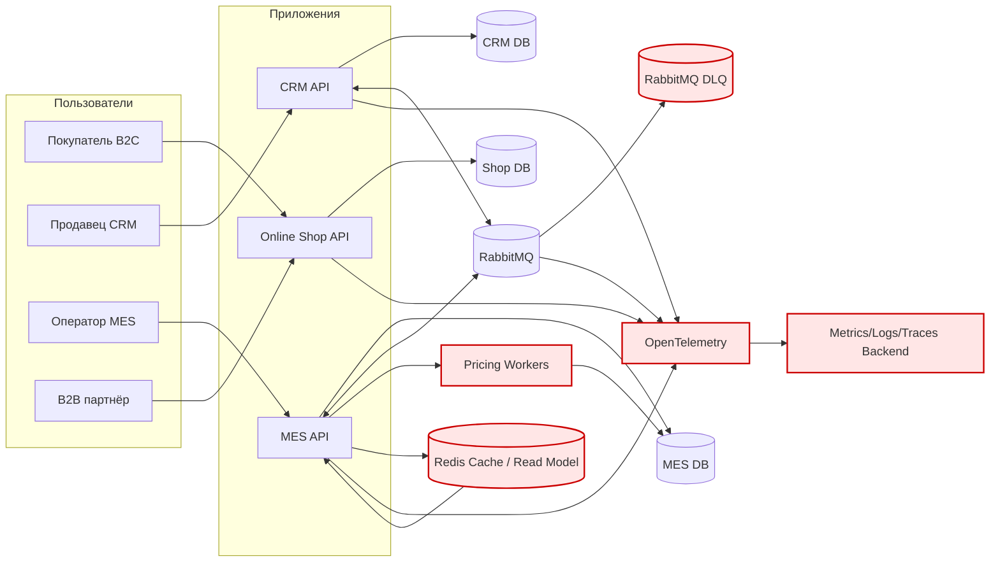

# Планирование: анализ, идентификация проблем и поиск решений

## 1) Коротко о текущей системе (как я понимаю)
- 3 приложения: Online-shop (Vue + Spring Boot), CRM (Vue + Spring Boot), MES (React + C#).
- CRM и MES связаны асинхронно через RabbitMQ.
- MES выполняет расчёт стоимости изделия (2–30 минут в зависимости от модели).
- Инфраструктура: по **1 инстансу на приложение** и по **1 инстансу на БД** (read/write в одном), окружения: dev/release/prod.
- Новая нагрузка: B2B-партнёры через API → рост заказов и жалоб на «потерянные» и «зависшие» заказы.

## 2) Проблемы и риски (что болит и почему это опасно)

### 2.1. Надёжность и потеря заказов
1. **Риск потери сообщений/дублирования** в интеграции CRM↔MES через RabbitMQ:
   - нет формализованной политики retry/DLQ;
   - нет end-to-end корреляции по orderId;
   - нет гарантированной идемпотентности обработчиков.
2. **Нет единого источника правды по статусам заказа** и видимости «где застряло»:
   - статусы меняются в разных системах;
   - если шаг «упал», пользователи видят только «непонятное состояние».

### 2.2. Производительность и масштабирование
3. **Узкое горлышко: расчёт стоимости (MES)**:
   - длительные операции (минуты-десятки минут) легко создают очередь задач и рост SLA.
4. **MES Dashboard (список заказов) тормозит даже после фильтра/пагинации**:
   - вероятно тяжёлые запросы + сортировки по «самым новым»;
   - 1 инстанс MES + 1 БД → рост конкуренции за ресурсы.
5. **Единичные инстансы приложений/БД**:
   - отсутствие горизонтального масштабирования;
   - SPOF и рост латентности при увеличении RPS.

### 2.3. Процессы поставки и качества
6. **Ручной релиз в release/prod + долгие ручные E2E** → задержки релизов.
7. **Нет наблюдаемости (monitoring/tracing/logging)** → реагируем «со слов клиента».

## 3) Инициативы (что делаем, чтобы это исправить)

### P0 (сразу, 0–1 спринт)
1. **Наблюдаемость “минимальный набор”**:
   - технический мониторинг (RPS, latency, error-rate, CPU/mem, RabbitMQ depth/DLQ),
   - централизованные логи,
   - базовый distributed tracing (корреляция по orderId / traceId).
2. **Надёжность RabbitMQ-интеграции**:
   - включить publisher confirms, persistent messages,
   - DLQ + retry policy,
   - идемпотентность на consumer’ах (orderId как ключ идемпотентности),
   - Outbox/Inbox паттерн (по возможности) для гарантированной публикации событий.

### P1 (1–3 месяца)
3. **Разделить “командные” и “долгие” операции MES**:
   - выделить воркеры/очередь на расчёт стоимости;
   - ограничить параллелизм; масштабировать воркеров отдельно.
4. **Ускорить MES Dashboard**:
   - серверное кеширование / read-model (“витрина заказов”) для списка;
   - индексы/оптимизация запросов;
   - подумать про отдельное хранилище для быстрых выборок (например, поисковый индекс) — как вариант.

### P2 (3–6 месяцев)
5. **Горизонтальное масштабирование**:
   - минимум: 2+ инстанса для API (shop/CRM/MES) за балансировщиком;
   - read-replica для БД (где возможно).
6. **Ускорение CI/CD**:
   - автотесты (smoke + critical-path E2E), “quality gates”,
   - более частые релизы маленькими порциями.

## 4) Приоритизация (почему так)
- Бизнес теряет деньги из-за “потерянных/зависших” заказов и отсутствия диагностики → сначала делаем **наблюдаемость + надёжность сообщений**, чтобы перестать “летать вслепую”.
- Второй удар — производительность MES (цена + дашборд). После того как научились видеть проблему, **ускоряем критические пути**.

## 5) Целевая архитектура через 6 месяцев (high level)
- Наблюдаемость (metrics + logs + traces) как стандарт.
- RabbitMQ с DLQ/retry и идемпотентными консьюмерами.
- Цена считается асинхронно: очередь “pricing jobs” + отдельный воркер-пул, масштабируемый независимо.
- MES Dashboard читает из быстрой витрины/кеша (Redis) или materialized read-model, обновляемой событиями статусов.
- Горизонтальное масштабирование API и хотя бы read-replica/разделение нагрузок по БД.
- CI/CD: автоматизированные проверки и более частые безопасные релизы.

## 6) Если можно сделать только 3 пункта за полгода
1) Наблюдаемость (monitoring + logging + tracing)  
2) Надёжность интеграции через RabbitMQ (DLQ/retry/идемпотентность/outbox)  
3) Ускорение MES Dashboard через витрину/кеш и событийное обновление  

Причина: эти 3 пункта дают **быстрый контроль над потерями заказов** и **самую заметную бизнес-ценность** (снижение просрочек, меньше обращений, меньше потерь контрактов).

---

## Диаграмма (целевое направление, упрощённо)

