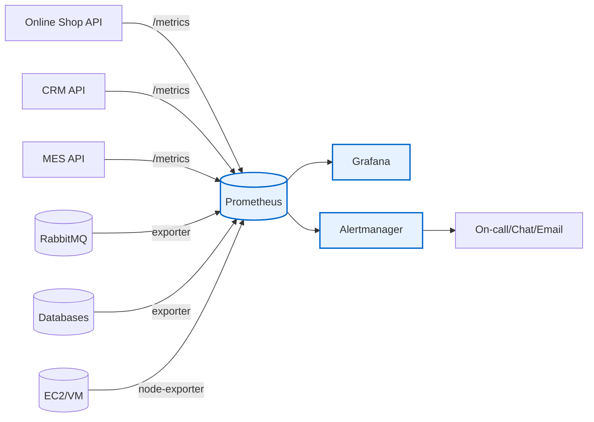

# Выбор и настройка мониторинга в системе

## Мотивация
С ростом нагрузки и появлением B2B-заказов “метрика фронта” (Яндекс Метрика) перестала показывать реальную картину. Нужно видеть:
- где именно деградирует система (API, очередь, БД, хранилище файлов),
- насколько часто происходят ошибки и насколько они массовые,
- почему и когда “растут хвосты” (backlog) и появляются просрочки,
- на что влияют изменения (релизы/конфиги/инфраструктура).

Итог для бизнеса: меньше потерянных заказов, меньше просрочек, быстрее разбор инцидентов, сохранение контрактов.

## Выбор подхода к мониторингу
Я предлагаю смешанный подход:
- **RED** для внешних API (Shop API / CRM API / MES API): Requests, Errors, Duration.
- **USE** для инфраструктуры (EC2, БД, RabbitMQ): Utilization, Saturation, Errors.
- Для “бизнес-цепочки заказа” — “Четыре золотых сигнала” на критическом пути + отдельные бизнес-метрики.

## Технологии (прагматичный стек)
- Metrics: **Prometheus** (+ exporters) или Managed Prometheus (если есть).
- Dashboards: **Grafana**.
- Alerting: **Alertmanager** (или Grafana Alerting).
- Экспортеры: node-exporter, cAdvisor (если контейнеры), RabbitMQ exporter, exporters для БД.
- Для Java/C#: Micrometer (Java), OpenTelemetry/Prometheus exporters (.NET).

## Что измеряем (выбор метрик из списка + добавленные)

### A) RabbitMQ (USE + очередь как “узкое место”)
1. **Number of message in flight in RabbitMQ**
   - Зачем: показывает backlog; рост → система не успевает обрабатывать.
   - Ярлыки: queue, vhost, publisher, consumer-group.
2. **Number of dead-letter-exchange letters in RabbitMQ**
   - Зачем: индикатор потерь/ошибок обработки.
   - Ярлыки: queue, reason (rejected/expired/maxlen), consumer-service.

Дополнительно (важно добавить):
- publish rate / deliver rate,
- consumer ack rate,
- unacked messages.

### B) API (RED)
3. **Number of requests (RPS)** для Shop/CRM/MES
   - Зачем: нагрузка, корреляция с деградацией.
   - Ярлыки: route, method, status_code, tenant (B2C/B2B), partner_id.
4. **Response time (latency)** для Shop/CRM/MES
   - Зачем: пользовательский опыт и SLA.
   - Ярлыки: route, method, status_code, tenant.
5. **Number of HTTP 500** для Shop/CRM/MES
   - Зачем: ошибки сервера — прямой индикатор инцидента.
   - Ярлыки: route, exception, tenant, partner_id.

Дополнительно:
- распределение латентности p50/p95/p99,
- timeouts,
- 4xx (особенно для API партнёров).

### C) Приложения/инстансы (USE)
6. **CPU %** / **Memory Utilisation** для Shop/CRM/MES API
   - Зачем: признак насыщения ресурсов.
   - Ярлыки: instance, env, service.
7. **Number of simultaneous sessions** (если это реально показатель нагрузки)
   - Зачем: оценка параллельности пользователей.
   - Ярлыки: env, service, user_role (operator/seller/partner).

### D) БД (USE)
8. **Memory Utilisation** / **Number of connections** для БД
   - Зачем: узкое место под ростом RPS и тяжёлых запросов.
   - Ярлыки: db_name, role (rw/ro), env.
9. **Size of db instance**
   - Зачем: планирование capacity и деградации (автовакуум, индексы).
   - Ярлыки: db_name, env.

### E) Хранилище файлов (S3/объектное)
10. **Size of S3 storage**
    - Зачем: контроль затрат и риска “закончится место”.
    - Ярлыки: bucket, env.

### F) Бизнес-метрики (добавляем поверх списка)
- **Order lead time**: время от SUBMITTED до SHIPPED/CLOSED.
- **Time in status**: сколько заказ “зависает” в каждом статусе.
- **Pricing job duration** и **pricing backlog**.
- **% orders missing status transitions** (нет ожидаемого следующего статуса N минут/часов).

## Показатели насыщенности (доп. задание)
Предлагаю пороги (пример, подстройка после baseline 1–2 недель):
- CPU > 80% 10 минут (warning), > 90% 5 минут (critical).
- Memory > 80% 10 минут (warning), > 90% 5 минут (critical).
- DB connections > 80% от max_connections 10 минут.
- RabbitMQ backlog (messages_ready) растёт N минут подряд или превышает X (например, 10k) — критично.
- DLQ > 0 и растёт — критично (создать тикет + пейдж).

Реакции:
- Автоматический тикет в backlog (Jira/YouTrack),
- Пейдж on-call (если есть),
- Временное масштабирование (добавить инстансы API/воркеров) — вручную или через авто-скейлер.

## План действий (draft)
1. Выбрать стек (Prometheus+Grafana) и развернуть в prod (и минимум в release).
2. Подключить exporters:
   - RabbitMQ exporter,
   - node-exporter,
   - DB exporter.
3. Внедрить application metrics:
   - Java Micrometer + Prometheus endpoint,
   - .NET metrics (OpenTelemetry/Prometheus).
4. Собрать дашборды:
   - RED по API,
   - USE по инфраструктуре,
   - RabbitMQ queues/DLQ,
   - “Business order flow” (lead time, time-in-status).
5. Настроить алерты (Alertmanager/Grafana):
   - SLO-based (error-rate, latency),
   - saturation (CPU/mem/db connections),
   - очереди (backlog/DLQ),
   - бизнес-алерты (order stuck).
6. Провести baseline (1–2 недели) и откалибровать пороги.

---

## Диаграмма (куда встраиваем мониторинг)

