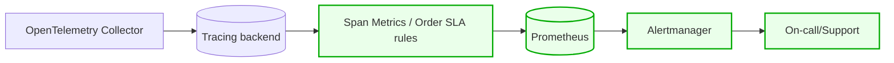

# Архитектурное решение по трейсингу

## 1) Мотивация
Сейчас команда сталкивается с “зависшими” и “потерянными” заказами и не понимает, где именно происходит сбой (API, очередь, БД, воркеры). Требуется end-to-end наблюдаемость цепочки заказа:
- быстро понять, **где сейчас заказ**, какой шаг последний успешный,
- найти “узкие места” по времени (например, pricing 30 минут),
- отличить “потеряли сообщение” от “обработка идёт, но медленно”.

Ожидаемый эффект (метрики 3–5 шт):
- MTTR (время восстановления) ↓
- % заказов “в неизвестном состоянии” ↓
- p95/p99 latency критических операций ↓
- доля просроченных заказов ↓ (через раннее обнаружение stuck)
- меньше обращений в поддержку ↓

## 2) Какие системы покрываем трейсингом (где может “сломаться” заказ)
Минимально (P0):
- Online Shop API (создание заказа, загрузка файла, submit)
- MES API (pricing, смена статусов производства)
- CRM API (подтверждение, закрытие)
- RabbitMQ (публикация/консюминг событий статусов)
- Интеграции с внешними партнёрами (B2B API)

## 3) Какие данные должны попадать в трейсинг
Обязательные атрибуты (в span attributes):
- trace_id / span_id
- correlation_id (если отдельный)
- order_id (ключевой!)
- customer_id / partner_id
- tenant (B2C/B2B)
- current_status + next_status
- message_id, queue, routing_key (для RabbitMQ)
- file_id / model_hash / polygon_count (для pricing)
- duration_ms, retry_count, error_type, error_message (коротко)

Важно: PII (ФИО/телефон/адрес) в трейсинг не писать — только id/хеши.

## 4) Предлагаемое решение (технологии и изменения)

### 4.1. Стек
- Инструментация: **OpenTelemetry SDK** (Java + .NET) + авто-инструментация где возможно.
- Сбор: **OpenTelemetry Collector** (gateway) — единая точка приёма.
- Хранилище трейсинга: **Jaeger** или **Grafana Tempo** (в связке с Grafana).
- Прокидывание контекста:
  - HTTP: W3C Trace Context (traceparent/tracestate)
  - RabbitMQ: заголовки сообщения (message headers) + message_id.

### 4.2. Что дорабатываем в сервисах
- Добавляем middleware/interceptor:
  - Java Spring Boot: filter/interceptor + OTel Java agent
  - .NET: OTel instrumentation (AspNetCore + RabbitMQ client hooks)
- Везде создаём/пробрасываем `order_id` как tag.
- Для RabbitMQ:
  - publisher: добавляет trace headers в message headers
  - consumer: извлекает headers и продолжает trace, создавая span “consume”.

### 4.3. Новые компоненты на диаграмме
- OTel Collector (gateway)
- Tracing backend (Tempo/Jaeger)
- UI (Grafana/Jaeger UI)

Новые элементы выделены **красным**.

```mermaid
flowchart LR
  Shop[Online Shop API]
  CRM[CRM API]
  MES[MES API]
  RMQ[(RabbitMQ)]

  %% New
  OTel[OpenTelemetry Collector]
  Trace[(Tracing backend: Jaeger/Tempo)]
  UI[Tracing UI (Grafana/Jaeger UI)]

  Shop --> RMQ
  MES --> RMQ
  CRM --> RMQ

  Shop --> OTel
  CRM --> OTel
  MES --> OTel
  RMQ --> OTel

  OTel --> Trace
  UI --> Trace

  classDef new fill:#ffe6e6,stroke:#cc0000,stroke-width:2px;
  class OTel,Trace,UI new;
```

### 4.4. Доп. задание: автоматический мониторинг процесса заказа и алертинг (зелёным)
Идея: из трейсинга/ивентов строим “контроль прохождения заказа”:
- правило “order stuck”: если заказ в статусе X дольше T → алерт
- правило “missing transition”: если после SUBMITTED нет PRICE_CALCULATED за T → алерт
Технически:
- либо генерируем метрики из трейсинга (Tempo metrics-generator / OTel Collector spanmetrics),
- либо пишем отдельный consumer событий статусов и считаем SLA в TSDB.



## 5) Компромиссы
- Если часть кода “чёрный ящик” (проприетарные компоненты) и нельзя внедрить OTel — трейсинг будет неполным.
- В асинхронных сценариях (RabbitMQ) без корректного прокидывания headers и идемпотентности сложно получить “чистую” картину.
- Большой объём трейсинга → затраты на хранение; придётся включать sampling (например, 10–20% обычных запросов, 100% ошибок).

## 6) Безопасность
- Доступ к UI (Grafana/Jaeger) только из корпоративной сети/VPN.
- RBAC: роли “Support”, “Dev”, “Admin”.
- Секреты (API keys) в vault/secret storage.
- В трейсах не храним PII; используем маскирование/хеширование идентификаторов.

