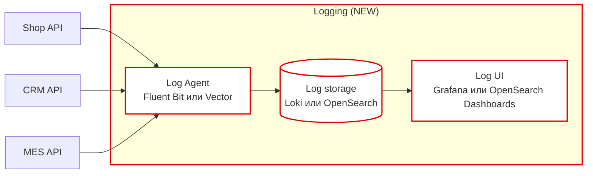

# Архитектурное решение по логированию

## 1) Какие логи собираем и из каких систем
Сбор логов нужен из:
- Online Shop API
- CRM API
- MES API
- RabbitMQ (аудит/события/ошибки брокера)
- Инфраструктура (reverse proxy/load balancer, если есть)

### Список обязательных INFO-событий (минимум)
1. **Создание заказа**: timestamp, order_id, customer_id/partner_id, tenant, source (web/api).
2. **Загрузка 3D-модели**: order_id, file_id, model_hash, size_bytes, polygon_count (если есть), результат валидации.
3. **Submit заказа**: order_id, корзина/комплектация (без цен/PII), tenant.
4. **Смена статуса заказа** (любая): order_id, from_status, to_status, actor (system/user role), timestamp.
5. **Запуск/завершение расчёта цены**: order_id, model_hash, duration_ms, outcome (ok/error), retry_count.
6. **Публикация/получение сообщения RabbitMQ**: message_id, correlation_id/trace_id, order_id, exchange, routing_key, queue, outcome (ack/nack/requeue).
7. **Ошибки интеграции с партнёрами**: partner_id, endpoint, status_code, latency, retry_count.

### Другие уровни логирования
- **WARN**: деградации (retry, timeout, circuit open, fallback), подозрительные входные данные.
- **ERROR**: исключения, неуспешные транзакции, потеря связи с БД/очередью.
- **DEBUG**: только в dev/release или по feature-flag; в prod — точечно и временно.

## 2) Мотивация
Сейчас разбор проблем идёт “со слов клиента”, поэтому:
- тратится много времени на воспроизведение,
- поддержка перегружена,
- ошибки повторяются.

Логирование даст:
- быстрый поиск по order_id (как “история заказа”),
- диагностика ошибок (stack trace + контекст),
- алертинг по аномалиям.

Метрики, на которые повлияет:
- MTTR ↓
- кол-во обращений в поддержку ↓
- % инцидентов, диагностируемых без участия разработчика ↑
- error-rate / повторяемость инцидентов ↓

## 3) Какие системы — в первую очередь (если ресурсов мало)
P0:
1) MES API (производство + pricing + dashboard) — основной источник жалоб.
2) Интеграция RabbitMQ (потери/дубли сообщений).
3) CRM API (подтверждение/закрытие заказа).

## 4) Предлагаемое решение

### 4.1. Стек (вариант без лицензий)
- Агент/коллектор на хостах/в контейнерах: **Fluent Bit** или **Vector**.
- Хранилище + поиск:
  - вариант A: **OpenSearch + OpenSearch Dashboards**
  - вариант B: **Grafana Loki + Grafana** (дешевле хранение, быстрый grep-поиск)
- Формат логов: **структурированный JSON**.
- Корреляция: обязательно писать `order_id` и `trace_id` (если включён трейсинг).

### 4.2. Диаграмма (новые компоненты)

### 4.3. Политика безопасности
- PII не пишем в логи; если неизбежно — маскирование (***), токенизация.
- RBAC по ролям (Support читает, Dev читает, Admin управляет).
- Разделение окружений: отдельные индексы/тенанты для dev/release/prod.
- Доступ только через VPN/SSO.

### 4.4. Политика хранения
- Индексы по сервисам и окружениям: `prod-mes-*`, `prod-crm-*`, ...
- Retention:
  - INFO: 14–30 дней (зависит от бюджета),
  - ERROR: 30–90 дней,
  - Агрегированные метрики/алерты — дольше.
- Ротация по размеру/времени + ILM (lifecycle policy).

### 4.5. Превращаем “сбор логов” в “анализ”
- Настраиваем алерты:
  - всплеск ERROR,
  - рост timeouts/retries,
  - резкий рост “создание заказов” (возможный DDoS/боты),
  - DLQ > 0.
- Детект аномалий (опционально): простые правила + позже ML/анализ.

## 5) Доп. задание: критерии выбора технологии (пример таблицы)
| Критерий | ELK | OpenSearch | Grafana Loki | Splunk |
|---|---|---|---|---|
| Лицензия | Elastic License | Apache 2.0 | AGPL/Apache (зависит от сборки) | проприетарная |
| Стоимость владения | средняя | ниже | низкая | высокая |
| Поиск/аналитика | сильная | сильная | “grep-поиск” + labels | очень сильная |
| Простота эксплуатации | средняя | средняя | выше | зависит от лицензии |
| Масштабирование | хорошее | хорошее | хорошее (с оговорками) | хорошее |

Выбор (для старта): OpenSearch или Loki — в зависимости от команды и бюджета.

