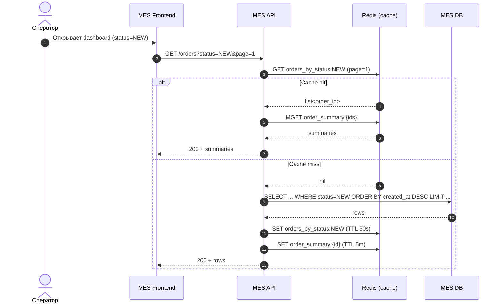
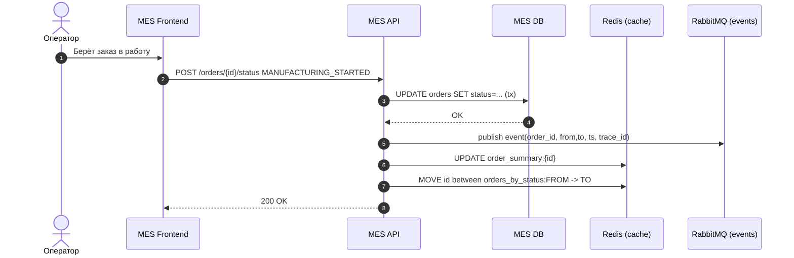

# Архитектурное решение по кешированию

## Мотивация
MES “тормозит” на первой странице (дашборд заказов) и это напрямую влияет на скорость старта работ по заказам.
Также часть запросов может повторяться (оператор/пользователь обновляет страницу; несколько операторов смотрят одни и те же статусы).

Цель кеширования:
- ускорить **чтение списка заказов по статусам** (самая частая операция на дашборде),
- снизить нагрузку на MES DB от “тяжёлых” выборок и сортировок по “самым новым”,
- при этом сохранить требование: операторам важны **самые новые** заказы.

## Что кешируем
Кешируем “витрину” для дашборда:
- `orders_by_status:{status}` — список последних N заказов (упорядоченный по времени создания/обновления)
- `order_summary:{order_id}` — краткая карточка заказа (id, статус, timestamps, приоритет, client type)

## Предлагаемое решение

### 1) Тип кеширования
**Серверное кеширование** (Redis) между MES API и MES DB.

Почему не клиентское:
- клиентское не решает нагрузку на БД от множества операторов;
- нужна единая консистентная “самая свежая” лента заказов.

### 2) Паттерн кеширования
Комбинация:
- **Cache-Aside** для чтения дашборда (MES API сначала смотрит Redis, при промахе — БД и кладёт в кеш),
- **Write-Through / Event-driven update** для обновления кеша при смене статуса (чтобы не ждать TTL и чтобы новые заказы появлялись сразу).

Почему не чистый Refresh-Ahead:
- нам важна событийная актуальность (новые заказы/статусы), а не “фоновое прогревание по расписанию”.

### 3) Стратегия инвалидации
Основная: **программная + по ключу** при событии “status_changed”.
Дополнительно: **TTL** как safety-net (например, 30–60 сек) на ключах списков, чтобы переживать расхождения.

Сравнение стратегий:

| Стратегия | Плюсы | Минусы | Где применяем |
|---|---|---|---|
| TTL (временная) | просто | можно видеть устаревшие данные | только как safety-net |
| По ключу (invalidate) | быстро, точечно | нужно правильно определить ключи | списки по статусам |
| Программная (write-through) | “самые свежие” данные | сложнее реализация | обновление при смене статуса |

### 4) Диаграммы последовательности (Mermaid)

#### 4.1. Чтение списка заказов (дашборд MES)

#### 4.2. Запись: изменение статуса заказа

### 5) Детали реализации (Redis структуры)
- `orders_by_status:{status}`: Redis Sorted Set
  - score = timestamp (created_at или last_status_change_at)
  - value = order_id
  - получаем “самые новые” через `ZREVRANGE`.
- `order_summary:{order_id}`: Redis Hash/JSON (короткая карточка).

### 6) Риски/компромиссы
- Консистентность: возможны редкие расхождения при падении после DB update, но до cache update.
  - Митигация: обновление кеша в том же сервисе после коммита + TTL safety-net.
- Нужна идемпотентность событий при повторной доставке.

---

## Артефакт PlantUML (если нужно)
В папке Task5 лежит файл `cache_sequence.puml`, который можно отрендерить в картинку локально.

